# RooMory

**서비스 명:** RooMory - "방마다 추억이 쌓이는 공간"

**설명:** Room + Memory의 합성어로 방마다 추억 게시판, 미션 인증, 편지, 채팅 등의 다양한 콘텐츠의 추억이 쌓이는 공간이라는 의미를 담고 있습니다.

## 1. 서비스 소개

### 어떤 서비스인가

기록방은 커플, 가족, 학급/동아리처럼 여러 사람이 함께 쓰는 공간입니다. 방 안에서 일상 대화, 사진이 포함된 추억, 미션 인증, 개인 편지를 기록하고, 나중에 필요한 기록만 골라 책 형태의 주문 요청까지 만들 수 있습니다.

### 누구를 위한 서비스인가

| 타깃 | 사용 상황 |
| --- | --- |
| 커플 | 기념일, 여행, 일상 대화를 한 권의 기록집으로 남기고 싶을 때 |
| 가족 | 가족 여행 사진, 편지, 함께한 미션을 모아 보관하고 싶을 때 |
| 학급/동아리 | 프로젝트, 활동 인증, 구성원 기록을 정리하고 싶을 때 |
### 주요 기능

| 기능 | 설명 |
| --- | --- |
| 기록방 | 방 생성, 초대 수락/거절, 방 관리, 방 나가기/삭제 보호 
| 채팅 | 방별 메시지 작성과 polling 기반 새 메시지 확인 |
| 추억 게시판 | 사진 업로드, 본문 작성, 댓글 |
| 미션 인증 | 기본/커스텀 미션, 사진 인증, 승인/동의, 댓글 |
| 편지 | 방 구성원 1명에게만 보이는 비공개 편지 |
| 전체 기록 캘린더 | 날짜별 채팅, 미션, 추억, 편지 흐름 확인 |
| 책 만들기 | 방, 상품, 기간, 콘텐츠를 선택해 템플릿 기반 미리보기와 예상 견적 생성 |
| 주문 관리 | 사용자 주문 상태/내역 조회, 운영자 주문 확인과 상태 변경 |

## 2. 실행 방법 (Docker)

아래 명령은 복사해서 그대로 실행할 수 있는 기준 흐름입니다.

```bash
# 저장소 클론
git clone https://github.com/passionryu/assignment-test.git
cd assignment-test

# 환경변수 준비
# 기본값으로도 실행할 수 있지만, 로컬 포트/DB 계정 변경이 필요하면 .env를 수정합니다.
cp .env.example .env

# 실행
docker compose -f service/infra/docker-compose.yml up --build
```

접속 주소:

| 항목 | 주소 |
| --- | --- |
| Client | http://localhost:5173 |
| Server | http://localhost:8080 |
| Health check | http://localhost:8080/api/health |

중지:

```bash
docker compose -f service/infra/docker-compose.yml down
```

## 3. 완성한 레벨

| 레벨 | 상태     | 구현 내용                                                              |
| --- |--------|--------------------------------------------------------------------|
| Lv1 | 완료     | 기록방, 채팅, 추억 게시판, 미션 인증, 편지, 전체 기록 캘린더                              |
| Lv2 | 완료     | 템플릿 기반 책 만들기, 상품 선택, 미리보기/견적, 주문 생성, 주문 상태/내역, 운영자 주문 관리           |
| Lv3 | 80% 완료 | 거시적 UI/UX 개선과 README 정리 진행. 최종 E2E, 최종 제출 문서 보강 - Mobile UI 대응 미완료 |


## 4. 사용자 경험(UI/UX) 설계

### 타깃 사용자

- 가입 절차 없이 서비스를 바로 확인해야 하는 과제 심사자
- 방 단위로 여러 사람의 기록을 모으고 싶은 일반 사용자
- 책 주문 요청과 상태 관리를 확인해야 하는 운영자 역할 사용자

### 핵심 화면/흐름

화면 정의서는 GitHub에서 바로 확인할 수 있도록 PDF 링크를 연결했습니다.

| 구분 | 문서 |
| --- | --- |
| Lv1 화면 정의서 | [SCREEN-001-main-page-screen-spec.pdf](docs/plan/screen-spec/v1.0/SCREEN-001-main-page-screen-spec.pdf) |
| Lv2 화면 정의서 | [SCREEN-004-lv2-book-order-screen-spec.pdf](docs/plan/screen-spec/v2.0/SCREEN-004-lv2-book-order-screen-spec.pdf) |

### 의도적으로 넣지 않은 것

| 제외한 기능 | 제외 이유 |
| --- | --- |
| 실제 회원가입/로그인 | 과제 검증 속도를 위해 사용자 선택 방식 채택 |
| WebSocket 채팅 | 핵심 과제 범위 대비 polling으로 충분하다고 판단 |
| PDF 직접 업로드 | 현재 서비스의 기록 기반 책 만들기 흐름과 맞지 않아 Lv2 범위에서 제외 |
| 실결제/실환불/실배송 | 주문 상태 관리 검증이 목적이므로 mock 상태 전이로 대체 |
| 예치금 모델 | 과제 구현 범위와 사용자 흐름 대비 과하다고 판단 |

### 주요 화면 캡처

심사자가 실행 전 핵심 화면 흐름을 빠르게 확인할 수 있도록 데스크톱 기준 캡처를 정리했습니다.
채팅 화면은 최종 캡처 확보 후 추가합니다.

<details>
<summary>사용자 선택 화면 - 일반 사용자와 운영자 계정을 구분해 체험을 시작하는 화면</summary>

| 데스크톱 화면 캡처 |
| --- |
| 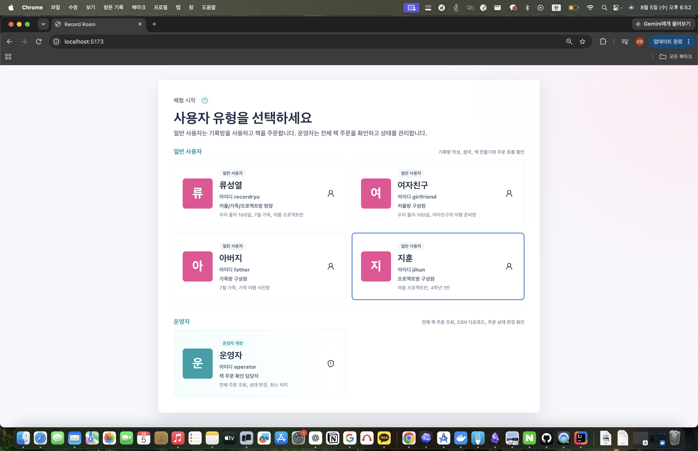 |

</details>

<details>
<summary>홈/전체 기록 캘린더 화면 - 참여 기록방 요약과 날짜별 기록 흐름을 함께 확인하는 화면</summary>

| 데스크톱 화면 캡처 | 추가 화면 캡처 |
| --- | --- |
| 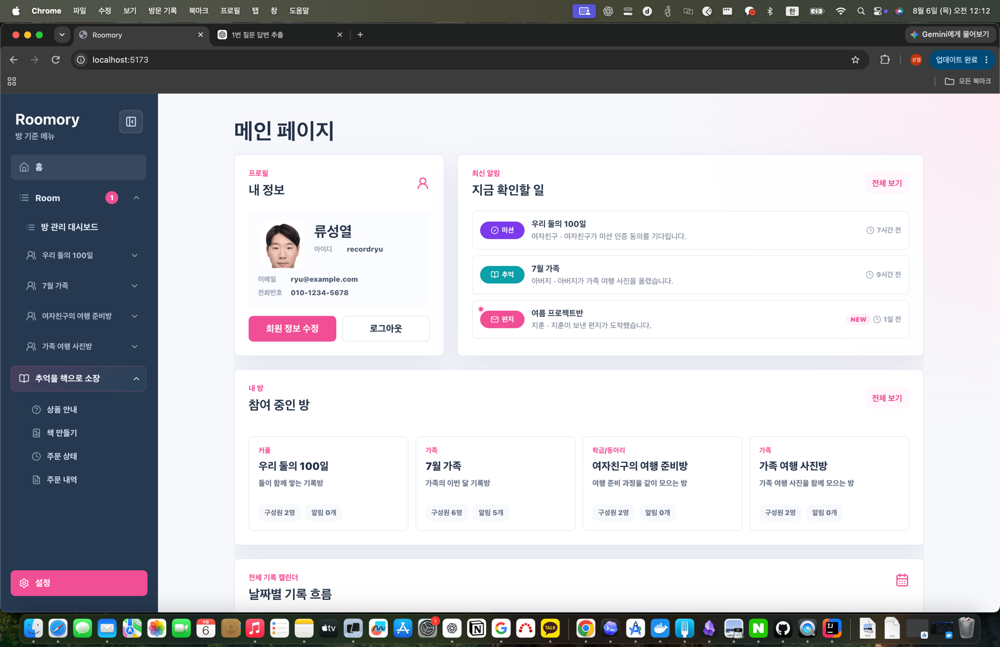 | 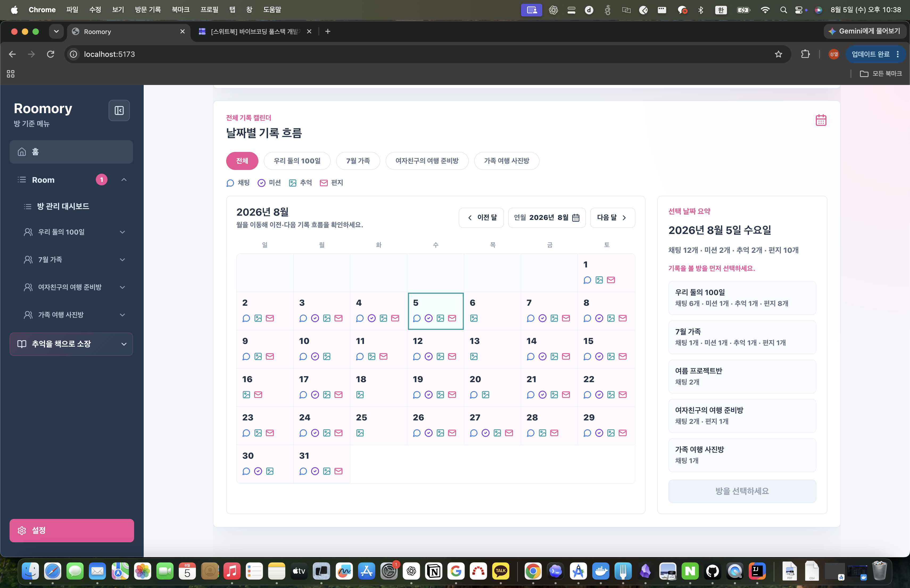 |

</details>

<details>
<summary>방 관리 대시보드 화면 - 새 방 생성, 초대 수락/거절, 참여 기록방 초대를 관리하는 화면</summary>

| 데스크톱 화면 캡처 |
| --- |
| 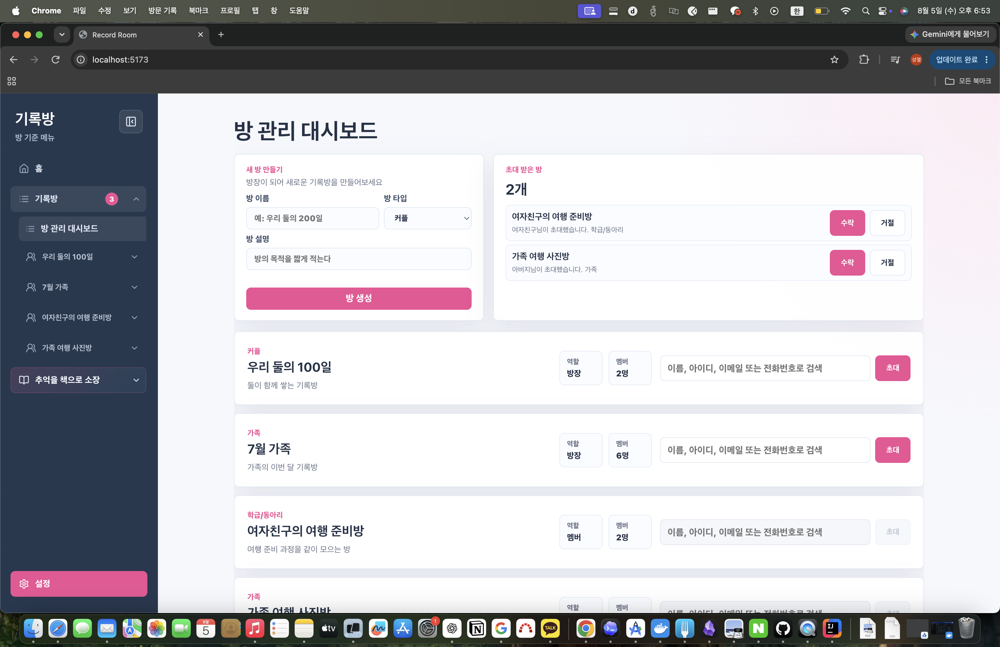 |

</details>

<details>
<summary>추억 게시판 화면 - 사진과 글을 남기고 댓글로 함께 기록을 이어가는 화면</summary>

| 데스크톱 화면 캡처 |
| --- |
| 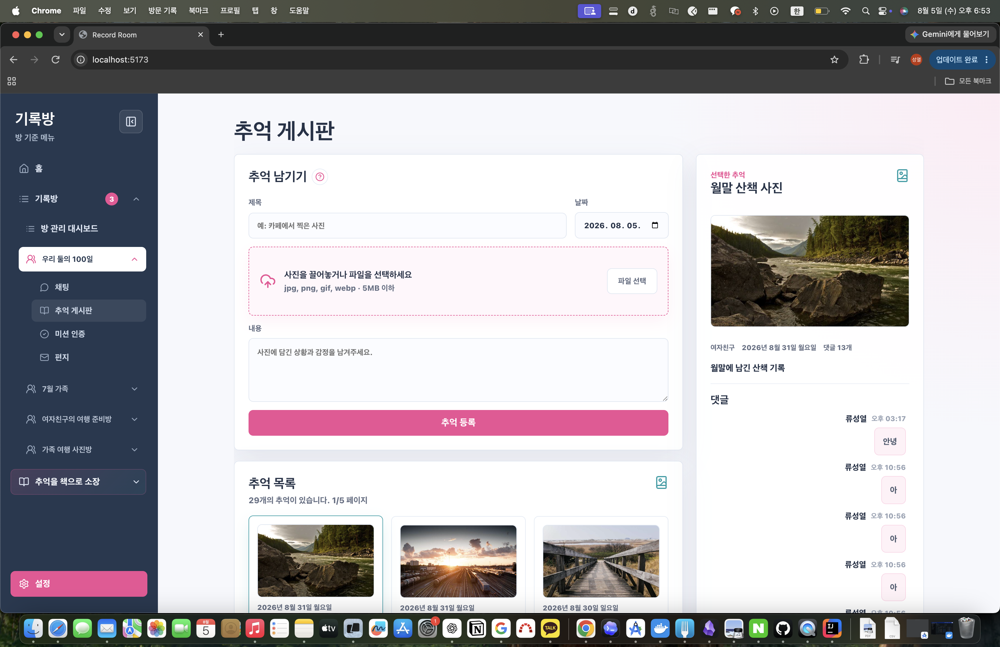 |

</details>

<details>
<summary>미션 인증 화면 - 방별 미션 인증, 동의 상태, 댓글을 확인하는 화면</summary>

| 데스크톱 화면 캡처 |
| --- |
| 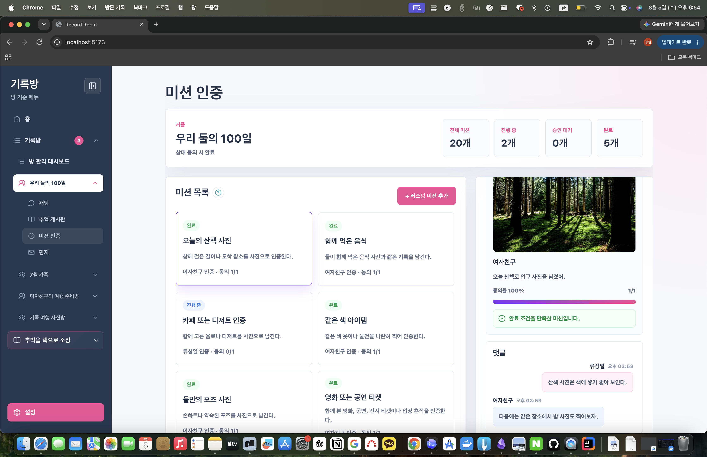 |

</details>

<details>
<summary>편지 화면 - 특정 멤버에게 보낸 비공개 편지를 확인하고 작성하는 화면</summary>

| 데스크톱 화면 캡처 |
| --- |
| 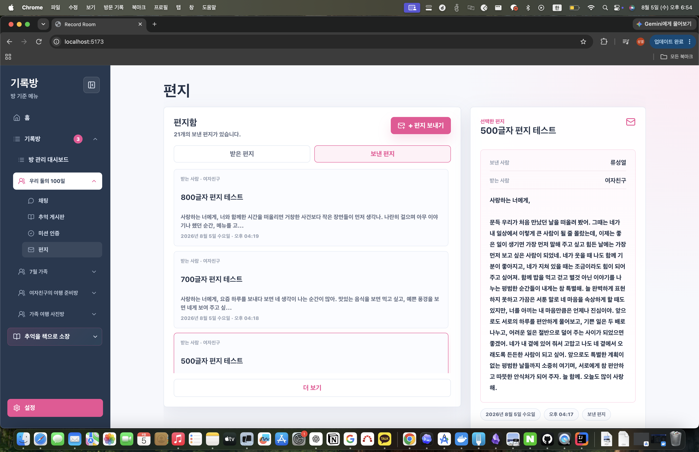 |

</details>

<details>
<summary>책 만들기 화면 - 방, 상품, 기간, 콘텐츠를 고르고 템플릿 기반 책 주문으로 이어가는 화면</summary>

| 데스크톱 화면 캡처 |
| --- |
| 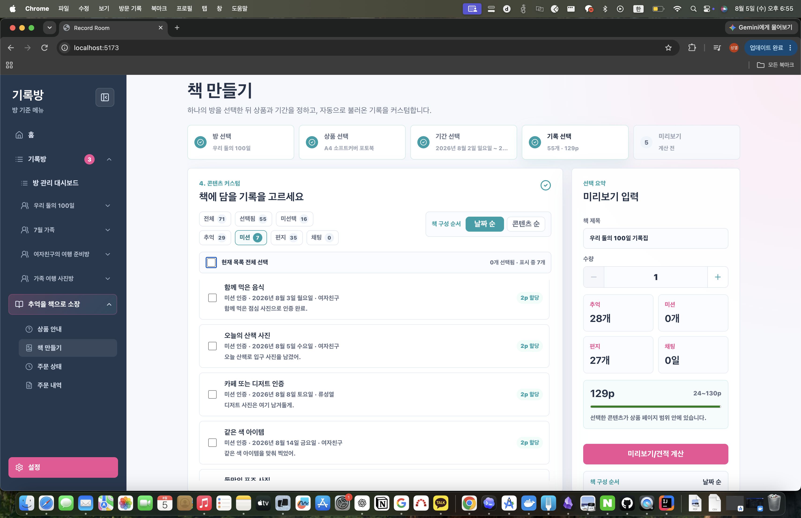 |

</details>

<details>
<summary>주문 상태/주문 상세 모달 화면 - 주문 목록에서 진행 단계와 상태 이력, 주문 상세를 확인하는 화면</summary>

| 데스크톱 화면 캡처 | 추가 화면 캡처 |
| --- | --- |
| 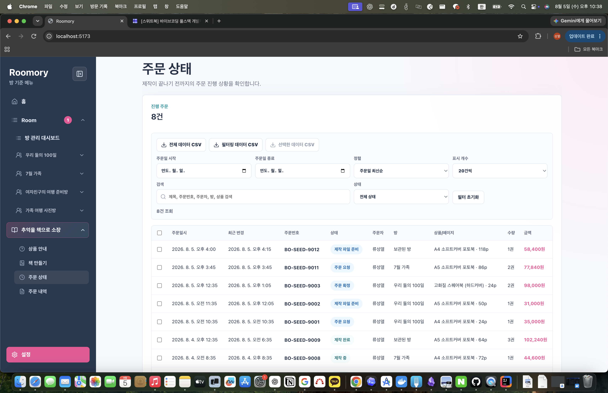 | 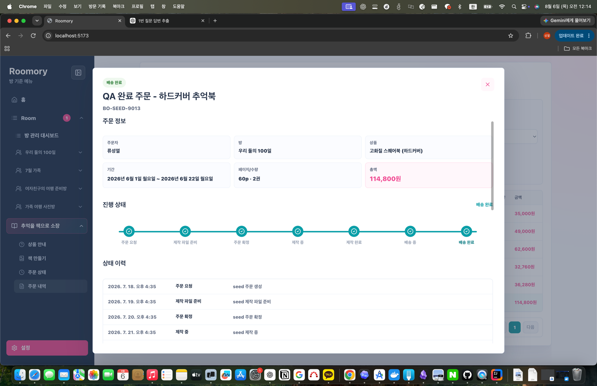 |

</details>

## 5. 기술 스택 및 아키텍처

### 기술 스택

| 영역 | 사용 기술 |
| --- | --- |
| Frontend | React 19, TypeScript, Vite 6, lucide-react |
| Backend | Kotlin, Spring Boot 3.3, Spring Web, Spring Data JPA, QueryDSL |
| Database | PostgreSQL 16, Flyway |
| Infra | Docker Compose |
| Test/QA | Gradle test, Vite build, curl smoke test, issue-scoped QA evidence |

### 기술 선택 근거

작성 예정: 최종 제출 전 작성자 관점에서 프론트엔드, 백엔드, DB 선택 근거를 보강합니다.

현재 1차 정리 기준:

- React/Vite: 실무와 학부에서 반복 사용한 스택이라 UI 구현을 빠르게 진행할 수 있어 채택함
- Kotlin/Spring Boot: 실무/학부 과제에서 REST API와 JPA 기반 서버를 많이 다뤄 과제 범위에 맞춰 안정적으로 구현하기 쉬워 채택함
- PostgreSQL/Flyway: 관계형 데이터 관리와 마이그레이션 경험이 있어 팀 협업처럼 유지보수 가능한 구조를 빠르게 구성할 수 있어 채택함
- Docker Compose: 실무 운영/과제 실행 환경에서 동일 조건 재현이 쉬워 심사 환경에서 재현성이 높기 때문에 채택함

### 디렉터리 구조

```text
assignment-test
├── README.md                  
├── docs                       # 기획, QA, 제출 산출물을 모아 둔 문서 영역
│   ├── assets                 # README/제출 문서에서 참조하는 이미지 자산
│   │   └── readme
│   │       └── screenshots    # README 주요 화면 캡처
│   ├── agents                 # AI 에이전트 협업 구조와 산출물 근거
│   │   └── assets
│   │       └── agent-system-architecture.png
│   ├── conventions            # 브랜치, 커밋, 작업 흐름 컨벤션
│   │   └── ...
│   ├── dev-spec               # 기능 구현 전후의 개발 명세와 API 흐름
│   │   └── ...
│   ├── plan                   # PM/PO, 화면 정의, 사용자 흐름 기획 산출물
│   │   └── screen-spec
│   │       ├── v1.0           # Lv1 화면 정의서와 승인 기록
│   │       │   ├── SCREEN-001-main-page-screen-spec.pdf # 화면 설계서
│   │       │   ├── screen-spec.md
│   │       │   ├── user-flow.md
│   │       │   ├── approval-log.md
│   │       │   └── screens/
│   │       ├── v2.0           # Lv2 책 주문 화면 정의서와 승인 기록
│   │       │   ├── SCREEN-004-lv2-book-order-screen-spec.pdf
│   │       │   ├── screen-spec.md
│   │       │   ├── user-flow.md
│   │       │   └── approval-log.md
│   │       └── v3.0           # Lv3 UI/UX 개선 계획 산출물
│   │           ├── screen-spec.md
│   │           ├── user-flow.md
│   │           └── approval-log.md
│   ├── qa                     # 이슈별 Human QA, 기술 검증, AI QA 결과
│   │   ├── issue-3/
│   │   ├── issue-4/
│   │   │   ├── QA_레포트.md # Human QA 산출물 본문
│   │   │   ├── QA_레포트.html # QA 결과 HTML 뷰어 파일
│   │   │   ├── settings-human-qa-fix.png # UI/흐름 수정 전후 증빙 스크린샷
│   │   │   ├── 보안_에이전트_보안_리뷰.md # 보안 관점 검토 기록
│   │   │   ├── 코드리뷰_에이전트_코드_리뷰.md # 코드 리뷰 이슈/권고사항 기록
│   │   │   ├── 테크리드_에이전트_1차검증.md # 기술 검증 1차 확인 문서
│   │   │   └── evidence/ # 테스트 캡처/로그 등 증빙 파일 모음
│   │   ├── ...
│   │   └── issue-32/
│   └── submission.md          # 제출용 보조 문서 초안
├── service                    # 실제 애플리케이션 코드
│   ├── client                 # React/Vite 프론트엔드
│   │   ├── src                # 화면, 상태, API 클라이언트
│   │   ├── package.json
│   │   └── vite.config.ts
│   ├── server                 # Kotlin/Spring Boot 백엔드
│   │   ├── src                # 도메인, API, 영속성, seed
│   │   ├── build.gradle.kts
│   │   └── gradlew
│   └── infra                  # Docker Compose와 로컬 실행 인프라
│       └── docker-compose.yml
├── test-results               # Playwright 등 자동 검증 산출물
│   └── playwright
└── tmp                        # 로컬 임시 파일. 제출 판단 근거에는 사용하지 않음
```
## 6. AI 도구 사용 내역


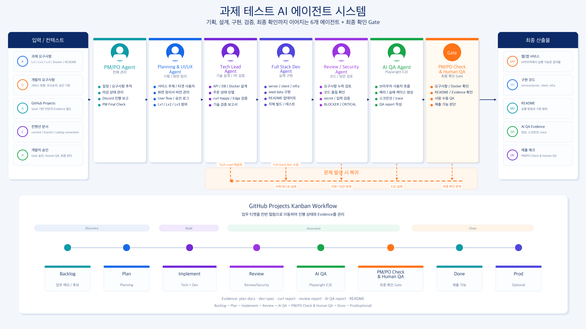

| AI 도구 | 활용 내용 |
| --- | --- |
| Codex | Multi-Agent 시스템 가동, 기획, 설계, 구현, 코드 리뷰, 보안 검증, QA, 문서화 |
| Perplexity | 자료 조사, 기존 서비스 벤치마킹 |
| GPT | 기타 AI 작업 |


## 7. 설계 의도

### 왜 이 서비스 아이디어를 선택했는가
먼저, 올해 3,4월에 진행된 스위트북 개발자 전형 과제 테스트로 올라온 Github 공개 레포지토리 7개를 참고했습니다. 

참고 결과 커플,팬, 독서, 여행 등등의 다양한 주제로 서비스를 확인할 수 있었습니다.    
그 중, 커플에 관한 서비스를 분석하며 조금 더 다양한 계층의 사람들에게 비즈니스를 수평적으로 확장할 수 있을것이라는 생각이 들었습니다. 
그리하여 커플, 가족, 학급, 동아리 등등 다양한 조직에서 이를 범용적으로 사용할 수 있는 서비스를 기획했습니다. 

### 사업 가능성을 어떻게 보는가

본 서비스는 “기록을 남기는 동기”와 “기억을 실물로 남기고 싶다는 수요”를 동시에 노린다. 사용자는 이미 매일 기록 콘텐츠를 생성하고 있지만, 이를 구조화해 정리·보관·소장하는 흐름이 분산돼 있어 상품화할 접점이 필요하다.  
Roomory는 이 접점을 ‘방 단위 협업 기록 → 추려 담기 → 책 제작 주문’으로 단순화한 점이 핵심이다.

- 시장성: 커플/가족/학급/동아리처럼 협업형 기록 소비자는 규모가 작지 않고, 기념일·여행·프로젝트 등 이벤트 기반 수요가 꾸준히 발생한다.
- 수익화 가능성: 초기에는 주문형 수익(책 제작 요청) 중심으로 시작하고, 추후 커스텀 템플릿·고급 편집 옵션·선물 기능으로 확장이 가능하다.
- 확장성: 현재은 MVP이지만, 재구매/재발행 UX와 시즌별 캠페인(졸업, 기념일, 입학/입대, 송별회 등)로 재구매 흐름을 만들 수 있다.

### 더 시간이 있었다면 추가할 기능
* Mobile/Tablet 화면 UI 대응
* PDF 업로드 방식의 제품 제작 방식
* 제품 미리보기 기능 고도화
