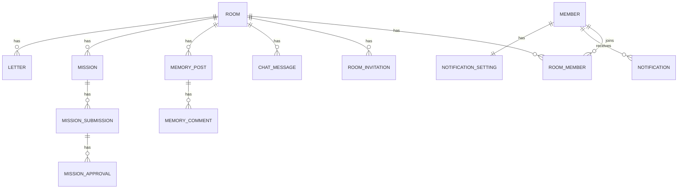

# DEV-002 Domain And DB Model

Status: Draft
Owner: Tech Lead Agent
Issue: #2

## 1. Purpose

이 문서는 Lv1 콘텐츠 서비스의 도메인 모델과 DB 모델 초안을 정의한다.

핵심 설계 원칙:

- 모든 기록은 `room` 기준으로 쌓인다.
- 모든 기록은 `occurred_date` 또는 `created_at`을 통해 캘린더와 연결된다.
- 메인 캘린더는 여러 방의 기록을 합산하거나 특정 방으로 필터링할 수 있어야 한다.
- 방 타입별 미션 완료 조건은 DB 상태로 계산 가능해야 한다.
- 책 만들기/주문 관련 테이블은 Lv1 범위에 넣지 않는다.

## 2. Domain Overview



## 3. Enums

### room_type

| Value | Meaning |
| --- | --- |
| COUPLE | 커플 방 |
| FAMILY | 가족 방 |
| GROUP | 학급/동아리 방 |

### room_member_role

| Value | Meaning |
| --- | --- |
| OWNER | 방장 |
| MEMBER | 일반 멤버 |

### invitation_status

| Value | Meaning |
| --- | --- |
| PENDING | 초대 대기 |
| ACCEPTED | 수락 |
| DECLINED | 거절 |
| EXPIRED | 만료 |

### mission_status

| Value | Meaning |
| --- | --- |
| ACTIVE | 진행중 |
| WAITING_APPROVAL | 승인 대기 |
| COMPLETED | 완료 |

### mission_approval_decision

| Value | Meaning |
| --- | --- |
| APPROVED | 동의 |
| REJECTED | 반려 |

### notification_type

| Value | Meaning |
| --- | --- |
| CHAT | 채팅 |
| LETTER | 편지 |
| MEMORY | 추억 |
| MISSION_APPROVAL_REQUEST | 미션 승인 요청 |
| MISSION_APPROVAL_RATE | 미션 동의율 |

### record_type

| Value | Meaning |
| --- | --- |
| CHAT | 채팅 |
| MEMORY | 추억 |
| MISSION | 미션 |
| LETTER | 편지 |

## 4. Tables

### members

| Column | Type | Null | Note |
| --- | --- | --- | --- |
| id | bigint | N | PK |
| display_name | varchar(50) | N | 화면 표시 이름 |
| username | varchar(40) | N | 로그인/식별용 아이디 |
| email | varchar(255) | N | 초대/식별용 고유값 |
| phone_number | varchar(30) | N | 초대/식별용 고유값 |
| profile_image_url | varchar(500) | Y | 프로필 이미지 |
| password_hash | varchar(255) | N | 더미 해시 허용 |
| is_deleted | boolean | N | soft delete |
| created_at | timestamptz | N | 생성 시각 |
| updated_at | timestamptz | N | 수정 시각 |

Indexes:

- unique `username`
- unique `email`
- unique `phone_number`

Rules:

- 이메일과 전화번호는 회원 정보 수정 화면에서 수정하지 않는다.
- 로그에는 이메일/전화번호 원문을 남기지 않는다.

### notification_settings

| Column | Type | Null | Note |
| --- | --- | --- | --- |
| member_id | bigint | N | PK, FK members.id |
| all_enabled | boolean | N | 전체 알림 |
| chat_enabled | boolean | N | 채팅 알림 |
| letter_enabled | boolean | N | 편지 알림 |
| memory_enabled | boolean | N | 추억 알림 |
| mission_enabled | boolean | N | 미션 알림 |
| updated_at | timestamptz | N | 수정 시각 |

Rules:

- `all_enabled=true`이면 개별 알림은 모두 true로 저장한다.
- `all_enabled=false`이면 개별 알림을 각각 조정할 수 있다.

### rooms

| Column | Type | Null | Note |
| --- | --- | --- | --- |
| id | bigint | N | PK |
| name | varchar(80) | N | 방 이름 |
| description | varchar(255) | Y | 방 설명 |
| type | varchar(20) | N | room_type |
| owner_member_id | bigint | N | FK members.id |
| created_at | timestamptz | N | 생성 시각 |
| updated_at | timestamptz | N | 수정 시각 |
| archived_at | timestamptz | Y | 비활성화 시각 |

Indexes:

- `owner_member_id`
- `created_at`

### room_members

| Column | Type | Null | Note |
| --- | --- | --- | --- |
| id | bigint | N | PK |
| room_id | bigint | N | FK rooms.id |
| member_id | bigint | N | FK members.id |
| role | varchar(20) | N | room_member_role |
| joined_at | timestamptz | N | 참여 시각 |
| left_at | timestamptz | Y | 나간 시각 |

Indexes:

- unique `room_id, member_id`
- `member_id`

Rules:

- active room member는 `left_at is null`로 판단한다.
- 방 접근 권한은 `room_members` 기준으로 검증한다.

### room_invitations

| Column | Type | Null | Note |
| --- | --- | --- | --- |
| id | bigint | N | PK |
| room_id | bigint | N | FK rooms.id |
| inviter_member_id | bigint | N | FK members.id |
| invitee_email | varchar(255) | Y | 초대 대상 이메일 |
| invitee_phone_number | varchar(30) | Y | 초대 대상 전화번호 |
| invitee_member_id | bigint | Y | 가입된 대상이면 연결 |
| status | varchar(20) | N | invitation_status |
| created_at | timestamptz | N | 생성 시각 |
| expires_at | timestamptz | N | 만료 시각 |
| responded_at | timestamptz | Y | 응답 시각 |

Indexes:

- `room_id, status`
- `invitee_member_id, status`
- `invitee_email, status`
- `invitee_phone_number, status`

Rules:

- 이메일 또는 전화번호 중 하나는 필수다.
- 둘 다 입력된 경우 둘 다 같은 사용자 식별에 사용한다.

### chat_messages

| Column | Type | Null | Note |
| --- | --- | --- | --- |
| id | bigint | N | PK |
| room_id | bigint | N | FK rooms.id |
| sender_member_id | bigint | N | FK members.id |
| body | text | N | 메시지 본문 |
| sent_at | timestamptz | N | 발송 시각 |
| occurred_date | date | N | 캘린더 집계 날짜 |
| deleted_at | timestamptz | Y | 삭제 시각 |

Indexes:

- `room_id, sent_at`
- `room_id, occurred_date`
- full text 후보: `body`

Rules:

- 날짜 구분선은 `occurred_date` 기준으로 렌더링한다.
- MVP 검색은 DB `LIKE` 또는 PostgreSQL full text 중 구현 난이도에 맞게 선택한다.

### memory_posts

| Column | Type | Null | Note |
| --- | --- | --- | --- |
| id | bigint | N | PK |
| room_id | bigint | N | FK rooms.id |
| author_member_id | bigint | N | FK members.id |
| title | varchar(100) | N | 제목 |
| body | text | N | 내용 |
| representative_image_url | varchar(500) | Y | 대표 이미지 |
| image_count | int | N | 이미지 수 |
| occurred_date | date | N | 추억 날짜 |
| created_at | timestamptz | N | 생성 시각 |
| updated_at | timestamptz | N | 수정 시각 |
| deleted_at | timestamptz | Y | 삭제 시각 |

Indexes:

- `room_id, occurred_date`
- `room_id, created_at`
- `author_member_id`

Rules:

- 영상 업로드는 Lv1에서 제외한다.
- MVP에서는 이미지 URL seed와 입력 문자열만 저장해도 된다.

### memory_comments

| Column | Type | Null | Note |
| --- | --- | --- | --- |
| id | bigint | N | PK |
| memory_post_id | bigint | N | FK memory_posts.id |
| author_member_id | bigint | N | FK members.id |
| body | text | N | 댓글 |
| created_at | timestamptz | N | 생성 시각 |
| deleted_at | timestamptz | Y | 삭제 시각 |

Indexes:

- `memory_post_id, created_at`

### missions

| Column | Type | Null | Note |
| --- | --- | --- | --- |
| id | bigint | N | PK |
| room_id | bigint | N | FK rooms.id |
| title | varchar(100) | N | 미션 제목 |
| description | varchar(500) | Y | 설명 |
| status | varchar(30) | N | mission_status |
| created_by_member_id | bigint | N | FK members.id |
| due_date | date | Y | 마감일 |
| completed_at | timestamptz | Y | 완료 시각 |
| created_at | timestamptz | N | 생성 시각 |
| updated_at | timestamptz | N | 수정 시각 |

Indexes:

- `room_id, status`
- `room_id, due_date`

### mission_submissions

| Column | Type | Null | Note |
| --- | --- | --- | --- |
| id | bigint | N | PK |
| mission_id | bigint | N | FK missions.id |
| submitter_member_id | bigint | N | FK members.id |
| body | text | N | 인증 글 |
| image_url | varchar(500) | Y | 인증 이미지 |
| submitted_at | timestamptz | N | 인증 시각 |
| occurred_date | date | N | 캘린더 집계 날짜 |

Indexes:

- `mission_id, submitted_at`
- `submitter_member_id`
- `occurred_date`

Rules:

- 미션 인증은 사진과 글로 구성한다.
- 한 미션에 여러 인증을 허용할지 여부는 MVP에서는 최신 인증 기준으로 단순화할 수 있다.

### mission_approvals

| Column | Type | Null | Note |
| --- | --- | --- | --- |
| id | bigint | N | PK |
| submission_id | bigint | N | FK mission_submissions.id |
| approver_member_id | bigint | N | FK members.id |
| decision | varchar(20) | N | mission_approval_decision |
| decided_at | timestamptz | N | 결정 시각 |

Indexes:

- unique `submission_id, approver_member_id`

Completion rules:

| Room type | Rule |
| --- | --- |
| COUPLE | submitter가 아닌 상대 멤버 1명의 APPROVED |
| FAMILY | OWNER APPROVED 또는 active member 과반 APPROVED |
| GROUP | OWNER APPROVED 또는 active member 과반 APPROVED |

과반 계산:

```text
approved_count > active_member_count / 2
```

### letters

| Column | Type | Null | Note |
| --- | --- | --- | --- |
| id | bigint | N | PK |
| room_id | bigint | N | FK rooms.id |
| sender_member_id | bigint | N | FK members.id |
| receiver_member_id | bigint | N | FK members.id |
| title | varchar(100) | N | 제목 |
| body | text | N | 본문 |
| sent_at | timestamptz | N | 보낸 시각 |
| occurred_date | date | N | 캘린더 집계 날짜 |
| read_at | timestamptz | Y | 읽은 시각 |
| deleted_by_sender_at | timestamptz | Y | 보낸 사람 삭제 |
| deleted_by_receiver_at | timestamptz | Y | 받은 사람 삭제 |

Indexes:

- `room_id, receiver_member_id, sent_at`
- `room_id, sender_member_id, sent_at`
- `room_id, occurred_date`

Rules:

- sender와 receiver는 모두 같은 방의 active member여야 한다.
- 편지는 채팅과 분리된 개인 기록으로 관리한다.

### notifications

| Column | Type | Null | Note |
| --- | --- | --- | --- |
| id | bigint | N | PK |
| receiver_member_id | bigint | N | FK members.id |
| room_id | bigint | N | FK rooms.id |
| actor_member_id | bigint | Y | 알림 발생 사용자 |
| type | varchar(40) | N | notification_type |
| summary | varchar(255) | N | 알림 요약 |
| target_type | varchar(40) | N | CHAT/MEMORY/MISSION/LETTER |
| target_id | bigint | N | 이동 대상 id |
| occurred_at | timestamptz | N | 발생 시각 |
| read_at | timestamptz | Y | 읽은 시각 |

Indexes:

- `receiver_member_id, occurred_at`
- `receiver_member_id, read_at`
- `room_id`

Rules:

- 메인 화면은 최신순 3개만 조회한다.
- 전체 보기 모달은 더 많은 알림을 조회한다.
- 알림 클릭 시 read 처리 후 target으로 이동한다.

## 5. Calendar Aggregation Model

별도 `calendar_records` 테이블은 만들지 않는다. Lv1에서는 기록 테이블을 union aggregate해서 조회한다.

Aggregation source:

| Source | record_type | Date |
| --- | --- | --- |
| chat_messages | CHAT | occurred_date |
| memory_posts | MEMORY | occurred_date |
| mission_submissions | MISSION | occurred_date |
| letters | LETTER | occurred_date |

Main calendar response는 다음 형태로 만든다.

```json
{
  "date": "2026-07-17",
  "roomId": 1,
  "roomName": "우리 둘의 100일",
  "chatCount": 8,
  "memoryCount": 1,
  "missionCount": 1,
  "letterCount": 0
}
```

## 6. Data Integrity Rules

- 모든 room content 생성 API는 room member 여부를 먼저 검증한다.
- 삭제된 content는 기본 목록에서 제외한다.
- 알림 target이 삭제된 경우 API는 삭제 안내 상태를 반환한다.
- member soft delete 시 로그인/초대/표시 정책을 별도 처리한다.
- seed 데이터는 삭제되지 않은 active 상태를 기본으로 한다.

## 7. Migration Order

1. members
2. notification_settings
3. rooms
4. room_members
5. room_invitations
6. chat_messages
7. memory_posts
8. memory_comments
9. missions
10. mission_submissions
11. mission_approvals
12. letters
13. notifications

## 8. Open Questions For PM/PO

- 회원가입/로그인 화면을 Lv1에서 구현할지, seed member 기반 데모 로그인으로 제한할지 결정이 필요하다.
- 추억 이미지 업로드를 실제 파일 업로드로 할지, URL 입력/더미 이미지로 대체할지 결정이 필요하다.
- 미션 인증은 미션당 인증 1개로 제한할지, 여러 인증을 허용할지 결정이 필요하다.
- 회원 탈퇴 후 작성 기록을 익명화할지, 작성자 표시를 유지할지 결정이 필요하다.
