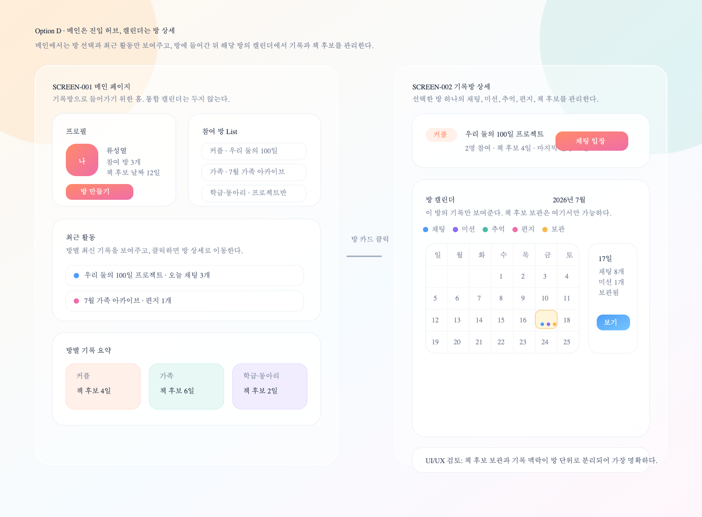

# SCREEN-001 메인 페이지 대안 검토

상태: Draft

## 대안 이미지

### Option C: 프로필 + 최신 알림 + 메인 캘린더

### Option D: 메인은 진입 허브, 캘린더는 방 상세

## 최종 선택

Human decision: **Option C**로 진행한다.

## PM/PO Agent 검토

| 항목 | 판단 |
| --- | --- |
| 메인 화면 역할 | 회원 정보 확인, 최신 알림 확인, 날짜별 기록 탐색 |
| 좌측 상단 | 활동 요약이 아니라 회원 프로필 정보만 제공 |
| 우측 상단 | 참여 방 List가 아니라 최신 알림 세 항목 제공 |
| 하단 캘린더 | 날짜별 기록 흐름 탐색에 집중 |
| 선택 날짜 요약 | `기록 보기`만 제공하고 보관 관련 액션은 제거 |

PM/PO Agent 결론:

- 메인 페이지에서 방 리스트를 제거하고 최신 알림을 두는 방향은 타당하다.
- 사용자가 서비스에 들어왔을 때 “지금 확인해야 할 일”을 바로 알 수 있다.
- 이메일과 전화번호는 초대/식별에 필요한 회원 정보이므로 프로필 카드에 둘 수 있다.
- 단, 실제 구현에서는 이메일/전화번호 노출 범위와 마스킹 정책을 별도로 검토해야 한다.

## Planning & UI/UX Agent 검토

| 영역 | UI/UX 판단 |
| --- | --- |
| 프로필 | 사람 식별 정보만 담아 카드 목적이 명확하다 |
| 최신 알림 | 사용자가 즉시 확인해야 할 이벤트를 우선 노출한다 |
| 전체 보기 모달 | 세 항목 제한으로 카드가 길어지는 문제를 막는다 |
| 캘린더 | 기록 타입 마커와 날짜 요약으로 기록 축적감을 보여준다 |
| 기록 보기 버튼 | 선택 날짜 요약의 다음 행동을 단순하게 만든다 |

Planning & UI/UX Agent 결론:

- 상단 두 카드가 서로 다른 역할을 가져 화면 이해가 쉬워졌다.
- 프로필 카드에 통계성 정보를 넣지 않는 결정이 적절하다.
- 최신 알림 카드에는 채팅, 편지, 추억, 미션 승인 요청, 미션 동의율 알림을 모두 수용할 수 있다.
- 선택 날짜 요약에서 보관 관련 버튼을 제거한 것은 MVP 화면 복잡도를 줄이는 데 유리하다.

## 후속 개선 메모

- 알림 전체 보기 모달 화면은 별도 SCREEN으로 정의한다.
- 회원 정보 수정 화면은 별도 SCREEN으로 정의한다.
- 이메일/전화번호 표시 방식은 개인정보 노출 정책과 함께 결정한다.
- 날짜별 기록 상세 화면에서 책 제작 후보 관리 여부를 별도로 설계한다.
