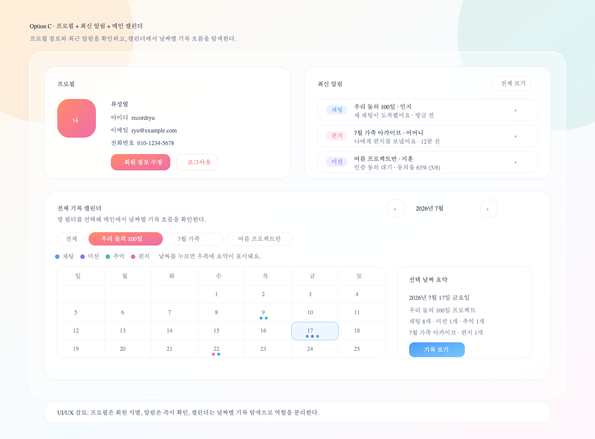

# 화면 정의서 v1.0

상태: Draft

## 시각 화면 정의서

이 문서의 승인 대상은 아래 이미지 화면 정의서다. 하단의 텍스트는 구현자가 화면 의도와 동작을 해석하기 위한 보조 명세다.



## 범위

이 문서는 `SCREEN-001 메인 페이지`를 정의한다.

메인 페이지는 모든 기능을 한 화면에 넣는 곳이 아니다. 사용자가 서비스에 들어왔을 때 다음 세 가지를 빠르게 이해하고, 각 상세 화면으로 이동하게 만드는 진입 대시보드다.

- 내 회원 프로필 정보
- 내가 지금 확인해야 할 최신 알림
- 날짜별 기록 흐름을 볼 수 있는 캘린더

## SCREEN-001 메인 페이지

### 1. 화면 목적

메인 페이지는 로그인 또는 서비스 진입 후 사용자가 가장 먼저 보는 홈 화면이다.

이 화면의 목적은 사용자가 바로 채팅, 미션 인증, 추억 업로드, 편지 작성을 하게 만드는 것이 아니라, **내 정보와 최신 알림을 확인하고, 날짜별로 쌓인 기록 흐름을 탐색하게 하는 것**이다.

주요 사용자 행동:

- 내 프로필 정보 확인
- 회원 정보 수정 또는 로그아웃
- 최신 알림 세 항목 확인
- 전체 알림 모달 열기
- 캘린더에서 전체 또는 방별 기록이 있는 날짜 확인
- 특정 날짜의 기록 요약을 확인한 뒤 상세 화면으로 이동

### 2. 화면 레이아웃

#### Desktop

```text
┌─────────────────────────────┬─────────────────────────────┐
│ 프로필                       │ 최신 알림                    │
│                             │                             │
└─────────────────────────────┴─────────────────────────────┘

┌───────────────────────────────────────────────────────────┐
│ 전체 기록 캘린더                                           │
│                                                           │
└───────────────────────────────────────────────────────────┘
```

#### Mobile

```text
┌─────────────────────────────┐
│ 프로필                       │
└─────────────────────────────┘
┌─────────────────────────────┐
│ 최신 알림                    │
└─────────────────────────────┘
┌─────────────────────────────┐
│ 전체 기록 캘린더              │
└─────────────────────────────┘
```

### 3. 레이아웃 규칙

- 상단 영역은 `프로필` 박스와 `최신 알림` 박스로 구성한다.
- 데스크톱에서는 두 박스를 좌우 2열로 배치한다.
- 데스크톱에서는 두 박스의 너비와 높이를 동일하게 맞춘다.
- 캘린더는 상단 두 박스 아래에 배치하고, 화면의 전체 콘텐츠 폭을 사용한다.
- 메인 페이지에는 채팅 입력, 미션 인증 폼, 추억 업로드 폼, 편지 작성 폼, 책 미리보기, 주문 기능을 직접 넣지 않는다.

### 4. 화면 구성 요소

#### A. 프로필 박스

위치:

- 데스크톱: 좌측 상단
- 모바일: 첫 번째 영역

목적:

- 현재 사용자가 누구인지 명확히 보여준다.
- 다른 사용자를 초대하거나 식별할 때 필요한 이메일/전화번호 기반 회원 정보를 확인할 수 있게 한다.
- 활동 통계나 방 요약이 아니라 순수 회원 정보만 담는다.

필수 표시 정보:

| 요소 | 설명 |
| --- | --- |
| 프로필 이미지 | 사용자의 아바타 또는 기본 프로필 이미지 |
| 이름 | 예: `류성열` |
| 아이디 | 예: `recordryu` |
| 이메일 | 초대/식별에 사용할 수 있는 고유 연락 정보 |
| 전화번호 | 초대/식별에 사용할 수 있는 고유 연락 정보 |
| 회원 정보 수정 | 회원 정보 수정 화면으로 이동 |
| 로그아웃 | 현재 세션 종료 |

제외 정보:

- 한 줄 상태 문구
- 이번 달 활동
- 기록한 날짜 수
- 추억 수
- 완료 미션 수
- 보낸 편지 수
- 참여 방 수
- 책 후보 날짜 수
- 방 생성/초대코드 입력 버튼

UX 기준:

- 프로필 박스는 계정 정보를 빠르게 확인하는 영역이다.
- 서비스 활동 수치를 섞지 않는다.
- 회원 정보 수정과 로그아웃은 프로필 박스 하단에 둔다.
- 실제 화면에서는 이메일/전화번호 전체 노출 여부를 개인정보 정책에 맞춰 결정한다.

#### B. 최신 알림 박스

위치:

- 데스크톱: 우측 상단
- 모바일: 두 번째 영역

목적:

- 사용자가 지금 확인해야 할 최신 이벤트를 보여준다.
- 사용자가 어느 방에서 어떤 일이 발생했는지 빠르게 이해하고 해당 기록으로 이동하게 한다.

필수 표시 정보:

| 요소 | 설명 |
| --- | --- |
| 알림 타입 | `채팅`, `편지`, `추억`, `미션` |
| 방 이름 | 알림이 발생한 기록방 이름 |
| 발생 사용자 | 알림을 만든 사용자 이름 |
| 알림 요약 | 사용자가 해야 할 행동 또는 확인할 내용 |
| 발생 시각 | 예: `방금 전`, `12분 전` |
| 전체 보기 | 전체 알림 모달을 연다 |

알림 타입:

| 타입 | 예시 |
| --- | --- |
| 채팅 | 어떤 방의 누가 채팅을 보냈는지 |
| 편지 | 누가 나에게 편지를 보냈는지 |
| 추억 | 어떤 방의 누가 추억을 게시했는지 |
| 미션 승인 요청 | 어떤 방의 누가 어떤 미션 인증 동의를 기다리는지 |
| 미션 동의율 | 어떤 방의 누가 미션을 인증했고 현재 동의율이 몇 퍼센트인지 |

표시 규칙:

- 최신 알림은 최신순으로 세 항목만 표시한다.
- 3개를 초과한 알림은 `전체 보기`를 눌러 모달에서 확인한다.
- 각 알림 카드는 클릭 가능하다.
- 알림 클릭 시 해당 방 또는 해당 기록 상세 위치로 이동한다.

전체 보기 모달:

```text
┌─────────────────────────────┐
│ 전체 알림                    │
│                             │
│ [채팅] ...                   │
│ [편지] ...                   │
│ [추억] ...                   │
│ [미션] ...                   │
│                             │
│ [닫기]                       │
└─────────────────────────────┘
```

UX 기준:

- 알림은 행동 우선순위가 높은 순서로 보여준다.
- 미션 승인 요청처럼 사용자의 확인이 필요한 알림은 일반 활동 알림보다 더 눈에 띄게 표현한다.
- 한 카드에 너무 많은 텍스트를 넣지 않는다.

#### C. 전체 기록 캘린더

위치:

- 상단 두 박스 아래
- 전체 콘텐츠 폭 사용

목적:

- 사용자가 참여 중인 기록방에서 날짜별로 어떤 기록이 있었는지 시각적으로 보여준다.
- 서비스의 핵심 가치인 “기록이 쌓인다”는 느낌을 만든다.
- 특정 날짜를 선택해 날짜별 기록 요약을 확인하게 한다.

캘린더 범위:

- 기본값은 `전체` 필터로 시작한다.
- `전체` 필터에서는 사용자가 참여 중인 모든 방의 기록을 합산해서 표시한다.
- 특정 방 필터를 선택하면 해당 방의 기록만 표시한다.

필수 표시 정보:

| 요소 | 설명 |
| --- | --- |
| 월 표시 | 예: `2026년 7월` |
| 이전/다음 월 이동 | 월 단위 캘린더 이동 |
| 방 필터 | `전체`, 개별 기록방 필터 |
| 날짜 그리드 | 월간 캘린더 |
| 기록 타입 마커 | 날짜별 기록 타입을 점 또는 배지로 표시 |
| 선택 날짜 상태 | 사용자가 클릭한 날짜를 강조 |
| 선택 날짜 요약 | 해당 날짜에 어떤 방에서 어떤 기록이 있었는지 표시 |

기록 타입 마커:

| 마커 | 의미 |
| --- | --- |
| 채팅 | 해당 날짜에 채팅 기록이 있음 |
| 미션 | 해당 날짜에 미션 인증 기록이 있음 |
| 추억 | 해당 날짜에 추억 업로드가 있음 |
| 편지 | 해당 날짜에 편지가 있음 |

선택 날짜 요약 예시:

```text
2026년 7월 17일 금요일
우리 둘의 100일 프로젝트
채팅 8개 · 미션 1개 · 추억 1개

7월 가족 아카이브
편지 1개

[기록 보기]
```

캘린더 동작:

| 사용자 행동 | 결과 |
| --- | --- |
| `전체` 필터 클릭 | 모든 방의 날짜별 기록을 합산해서 표시 |
| 개별 방 필터 클릭 | 선택한 방의 날짜별 기록만 표시 |
| 날짜 클릭 | 선택 날짜 요약 표시 |
| 기록이 없는 날짜 클릭 | `이 날짜에는 아직 기록이 없어요.` 표시 |
| `기록 보기` 클릭 | 날짜별 기록 상세 화면으로 이동 |
| 이전/다음 월 클릭 | 캘린더 월 변경 |

UX 기준:

- 캘린더는 메인 페이지에서 가장 큰 영역이다.
- 날짜별 기록 마커는 직관적이어야 한다.
- 마커 색상은 범례와 함께 제공한다.
- 선택 날짜 요약은 간단해야 하며, 전체 타임라인처럼 길어지면 안 된다.
- 선택 날짜 요약에는 보관/책 후보 관련 액션을 넣지 않는다.
- 상세 채팅, 미션 인증, 추억 업로드, 편지 내용은 별도 상세 화면에서 보여준다.

### 5. 메인 페이지에서 직접 제공하지 않는 기능

메인 페이지에는 아래 기능을 직접 넣지 않는다.

- 채팅 메시지 작성
- 추억 업로드
- 미션 인증
- 편지 작성
- 책 미리보기 생성
- 주문 생성
- 주문 상태 조회
- 날짜 보관/책 후보 관리

이 기능들은 사용자가 기록방 또는 기록 상세 화면으로 들어간 뒤 수행한다.

### 6. 화면 이동 정의

| 사용자 행동 | 이동 또는 결과 |
| --- | --- |
| `회원 정보 수정` 클릭 | 회원 정보 수정 화면으로 이동 |
| `로그아웃` 클릭 | 로그아웃 처리 |
| 최신 알림 카드 클릭 | 해당 방 또는 해당 기록 상세 위치로 이동 |
| 최신 알림 `전체 보기` 클릭 | 전체 알림 모달 표시 |
| 캘린더 방 필터 클릭 | 캘린더를 해당 방 기준으로 전환 |
| 캘린더 날짜 클릭 | 메인 페이지 안에서 날짜 요약 표시 |
| 날짜 요약의 `기록 보기` 클릭 | 날짜별 기록 상세 화면으로 이동 |
| 이전/다음 월 클릭 | 캘린더 월 변경 |

### 7. 필요한 데이터

프로필 데이터:

- 사용자 id
- 이름
- 아이디
- 이메일
- 전화번호
- 프로필 이미지

최신 알림 데이터:

- 알림 id
- 알림 타입
- 방 id
- 방 이름
- 발생 사용자 id
- 발생 사용자 이름
- 알림 요약
- 발생 시각
- 읽음 여부
- 이동 대상 id

캘린더 데이터:

- 날짜
- 방 id
- 방 이름
- 기록 타입별 개수

### 8. UI/UX Agent 최종 검토

판단:

- 좌측 상단은 사람 식별을 위한 프로필 정보만 담는 것이 명확하다.
- 우측 상단은 최신 알림을 두어 사용자가 지금 확인해야 할 일을 빠르게 파악하게 한다.
- 하단 캘린더는 기록 탐색에만 집중시키고, 보관/책 후보 관리 개념은 제거하는 것이 낫다.

역할 분리:

| 영역 | 역할 |
| --- | --- |
| 프로필 | 사용자가 누구인지 식별 |
| 최신 알림 | 지금 확인해야 할 이벤트 안내 |
| 캘린더 | 날짜별 기록 흐름 탐색 |

검토 결과:

- 상단 두 카드의 시각적 무게가 동일하다.
- 프로필 카드와 알림 카드가 서로 다른 목적을 가진다.
- 메인 페이지가 기능 과밀 화면으로 보이지 않는다.
- 선택 날짜 요약에서 보관 관련 개념을 제거해 사용자의 다음 행동이 `기록 보기`로 단순해졌다.

### 9. 승인 기준

- 프로필 카드에서 이미지, 이름, 아이디, 이메일, 전화번호가 확인된다.
- 회원 정보 수정과 로그아웃이 제공된다.
- 최신 알림은 최신순 세 항목만 표시된다.
- 전체 알림은 모달로 확인할 수 있다.
- 캘린더에서 채팅, 미션, 추억, 편지 기록 존재 여부가 구분된다.
- 선택 날짜 요약에는 `기록 보기`만 주요 액션으로 표시된다.
- 선택 날짜 요약에 보관/책 후보 관련 액션이 없다.
