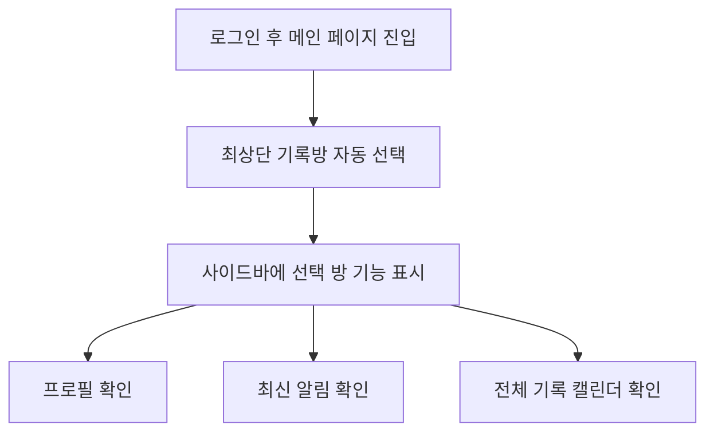
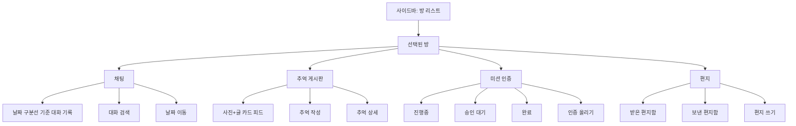
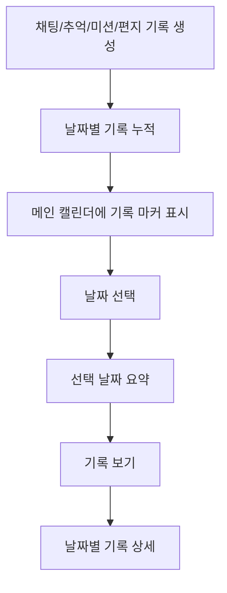
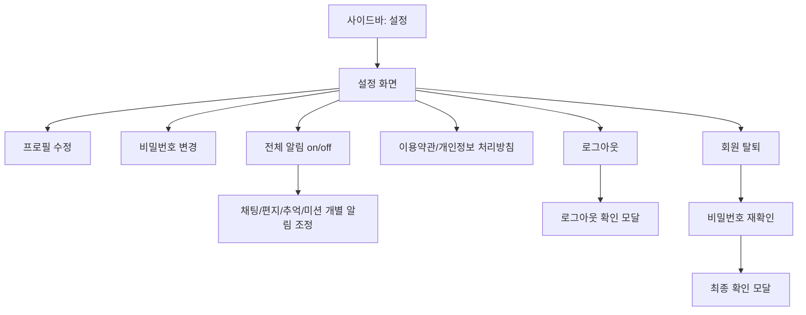

# User Flow v1.0

Status: Draft - Human approval 대기

## 메인 진입 흐름

```mermaid
flowchart TD
    A["로그인 후 메인 페이지 진입"] --> B["최상단 기록방 자동 선택"]
    B --> C["사이드바에 선택 방 기능 표시"]
    C --> D["프로필 확인"]
    C --> E["최신 알림 확인"]
    C --> F["전체 기록 캘린더 확인"]
```

## 방 내부 기능 흐름

```mermaid
flowchart TD
    A["사이드바: 방 리스트"] --> B["선택된 방"]
    B --> C["채팅"]
    B --> D["추억 게시판"]
    B --> E["미션 인증"]
    B --> F["편지"]

    C --> G["날짜 구분선 기준 대화 기록"]
    C --> H["대화 검색"]
    C --> I["날짜 이동"]

    D --> J["사진+글 카드 피드"]
    D --> K["추억 작성"]
    D --> L["추억 상세"]

    E --> M["진행중"]
    E --> N["승인 대기"]
    E --> O["완료"]
    E --> P["인증 올리기"]

    F --> Q["받은 편지함"]
    F --> R["보낸 편지함"]
    F --> S["편지 쓰기"]
```

## 날짜 기반 재탐색 흐름

```mermaid
flowchart TD
    A["채팅/추억/미션/편지 기록 생성"] --> B["날짜별 기록 누적"]
    B --> C["메인 캘린더에 기록 마커 표시"]
    C --> D["날짜 선택"]
    D --> E["선택 날짜 요약"]
    E --> F["기록 보기"]
    F --> G["날짜별 기록 상세"]
```

## 설정 흐름

```mermaid
flowchart TD
    A["사이드바: 설정"] --> B["설정 화면"]
    B --> C["프로필 수정"]
    B --> D["비밀번호 변경"]
    B --> E["전체 알림 on/off"]
    E --> F["채팅/편지/추억/미션 개별 알림 조정"]
    B --> G["이용약관/개인정보 처리방침"]
    B --> H["로그아웃"]
    H --> I["로그아웃 확인 모달"]
    B --> J["회원 탈퇴"]
    J --> K["비밀번호 재확인"]
    K --> L["최종 확인 모달"]
```
