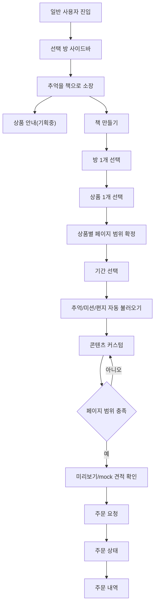
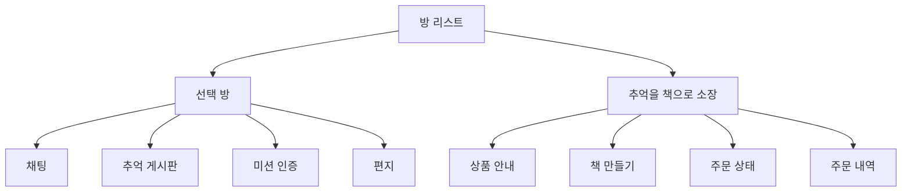
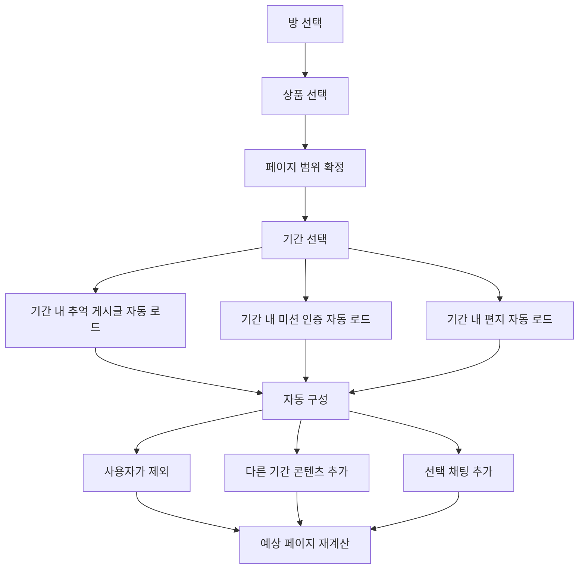
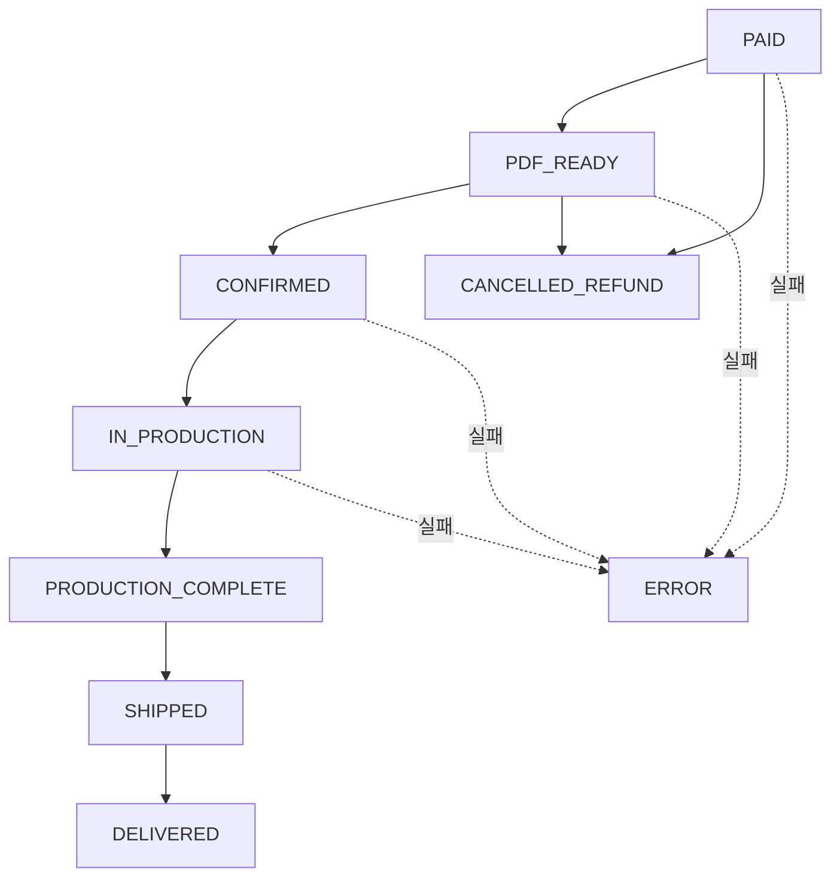
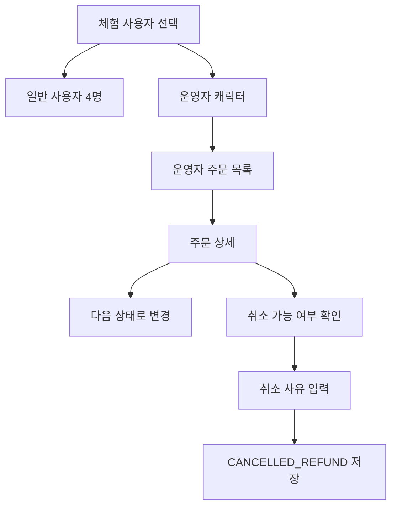
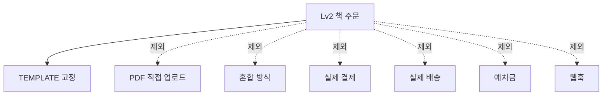

# User Flow v2.0

Status: Draft - Human approval 대기

## 책 만들기 사용자 흐름

```mermaid
flowchart TD
    A["일반 사용자 진입"] --> B["선택 방 사이드바"]
    B --> C["추억을 책으로 소장"]
    C --> P["상품 안내(기획중)"]
    C --> D["책 만들기"]
    D --> E["방 1개 선택"]
    E --> F["상품 1개 선택"]
    F --> G["상품별 페이지 범위 확정"]
    G --> H["기간 선택"]
    H --> I["추억/미션/편지 자동 불러오기"]
    I --> J["콘텐츠 커스텀"]
    J --> K{"페이지 범위 충족"}
    K -- "아니오" --> J
    K -- "예" --> L["미리보기/mock 견적 확인"]
    L --> M["주문 요청"]
    M --> N["주문 상태"]
    N --> O["주문 내역"]
```

## 일반 사용자 사이드바 흐름

```mermaid
flowchart TD
    A["방 리스트"] --> B["선택 방"]
    B --> C["채팅"]
    B --> D["추억 게시판"]
    B --> E["미션 인증"]
    B --> F["편지"]
    A --> G["추억을 책으로 소장"]
    G --> H["상품 안내"]
    G --> I["책 만들기"]
    G --> J["주문 상태"]
    G --> K["주문 내역"]
```

## 콘텐츠 자동 로드/커스텀 흐름

```mermaid
flowchart TD
    A["방 선택"] --> B["상품 선택"]
    B --> C["페이지 범위 확정"]
    C --> D["기간 선택"]
    D --> E["기간 내 추억 게시글 자동 로드"]
    D --> F["기간 내 미션 인증 자동 로드"]
    D --> G["기간 내 편지 자동 로드"]
    E --> H["자동 구성"]
    F --> H
    G --> H
    H --> I["사용자가 제외"]
    H --> J["다른 기간 콘텐츠 추가"]
    H --> K["선택 채팅 추가"]
    I --> L["예상 페이지 재계산"]
    J --> L
    K --> L
```

## 주문 상태 흐름

```mermaid
flowchart TD
    A["PAID"] --> B["PDF_READY"]
    B --> C["CONFIRMED"]
    C --> D["IN_PRODUCTION"]
    D --> E["PRODUCTION_COMPLETE"]
    E --> F["SHIPPED"]
    F --> G["DELIVERED"]

    A --> H["CANCELLED_REFUND"]
    B --> H

    A -.실패.-> I["ERROR"]
    B -.실패.-> I
    C -.실패.-> I
    D -.실패.-> I
```

## 운영자 진입/주문 확인 흐름

```mermaid
flowchart TD
    A["체험 사용자 선택"] --> B["일반 사용자 4명"]
    A --> C["운영자 캐릭터"]
    C --> D["운영자 주문 목록"]
    D --> E["주문 상세"]
    E --> F["다음 상태로 변경"]
    E --> G["취소 가능 여부 확인"]
    G --> H["취소 사유 입력"]
    H --> I["CANCELLED_REFUND 저장"]
```

## 제외 흐름

```mermaid
flowchart TD
    A["Lv2 책 주문"] --> B["TEMPLATE 고정"]
    A -.제외.-> C["PDF 직접 업로드"]
    A -.제외.-> D["혼합 방식"]
    A -.제외.-> E["실제 결제"]
    A -.제외.-> F["실제 배송"]
    A -.제외.-> G["예치금"]
    A -.제외.-> H["웹훅"]
```
